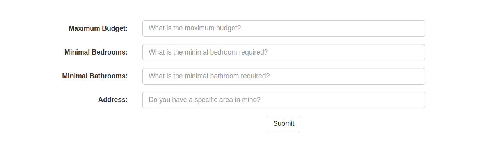
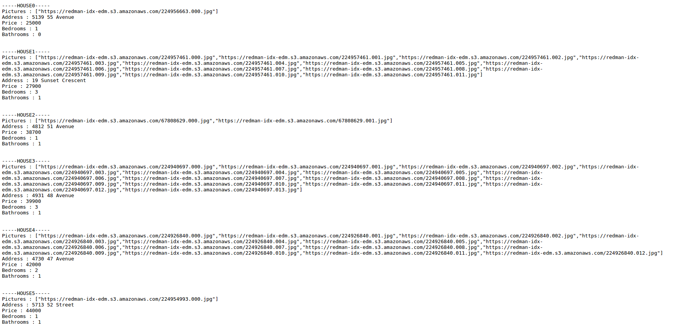
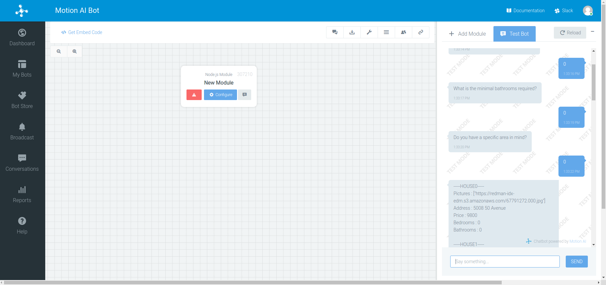
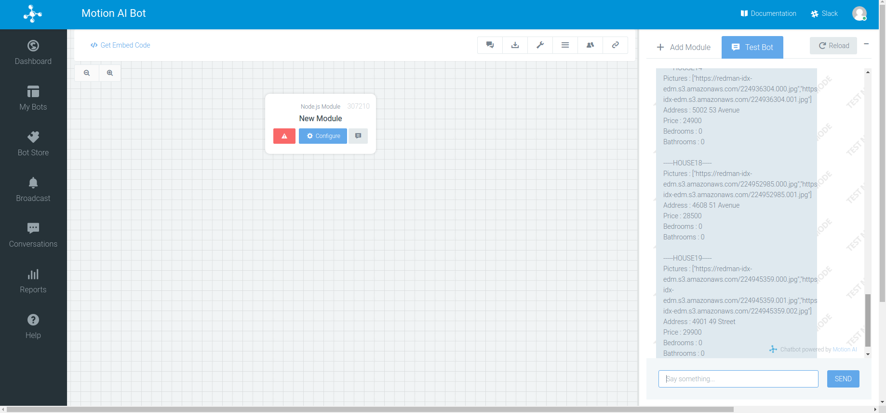

# node-express-bot
* This is trivia bot using Node.js, Express.js and RESTful APIs.
* This node.js file can be also tested in Motion.ai.
* You can find homes using this bot.
## Run
* ```sudo npm install -g q```
* ```sudo npm install -g express```
* ```sudo npm install -g request```
* ```node node.js```
## Result


## Result in Motion.ai


